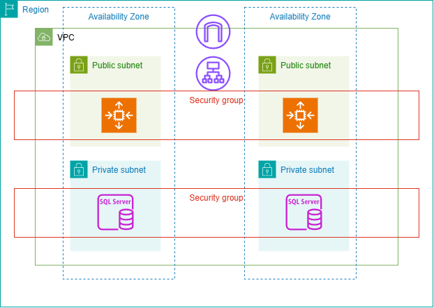

# 🛒 Online E-commerce
 
Este es un proyecto de infraestructura en aws que aplica conceptos de terraform, docker, y elementos en la nube. 

## 🚀 Objetivo

Construir la infraestructura necesaria para soportar sitio de e-commerce y una base de datos vinculada al mismo. Esta debe ser resiliente y escalable para el sitio web, teniendo en cuenta la seguridad y facilidad para el usuario que usa el repositorio. 

## 🔧 Dependencias

Deben estar presentes las siguientes herramientas en el host:

1. AWSCLI
2. Git
3. Terraform

### Quick start en RH Linux 

Instalación de dependencias:
``` bash
sudo yum install -y git
sudo yum install -y yum-utils
sudo yum-config-manager --add-repo https://rpm.releases.hashicorp.com/RHEL/hashicorp.repo
sudo yum install -y terraform
curl "https://awscli.amazonaws.com/awscli-exe-linux-x86_64.zip" -o "awscliv2.zip"
unzip awscliv2.zip
sudo ./aws/install
```
Para desplegar la infraestructura:
1. Configurar las credenciales de AWSCLI con `aws configure`
2. Clonar el repo y ejecutar terraform
```shell 
git clone https://github.com/AA241131/ISC-Obligatorio
cd ISC-Obligatorio/terraform
terraform init
terraform plan
terraform apply -auto-approve
```
## Estructura del repositorio
``` shell 
└── ISC-Obligatorio
    ├── e-commerce                            # applicacion
    ├── README.md                             # este archivo
    └── terraform                             # directorio de terraform
        ├── main.tf                           # root main
        ├── modules                           # directorio de módulos
        │   ├── autoscaling-module            # módulo de ASG
        │   ├── ec2-module                    # módulo de instancias ec2
        │   ├── rds-module                    # módulo de base de datos
        │   ├── s3-module                     # módulo de bucket s3
        │   ├── sec-module                    # módulo de SG
        │   └── vpc-module                    # módulo de red
        ├── output.tf                         # salidas del root
        ├── user_data_bastion.tpl             # user data para el bastión
        ├── user_data.launch_template.tpl     # user data para app servers
        ├── valores.auto.tfvars               # valores por defecto
        └── variables.tf                      # valores parametrizados

```
## Arquitectura

### Instancias

La selección de la AMI se hizo ordenando por fecha de creación las Amazon Linux 2023, free tier, con un disco EBS mayor a 8 GB:
``` shell
aws ec2 describe-images \
  --region us-east-1 \
  --owners amazon \
  --filters "Name=name,Values=al2023-ami-*-x86_64" "Name=state,Values=available" "Name=free-tier-eligible,Values=true" \
  --query 'Images[?length(BlockDeviceMappings[?Ebs.VolumeSize>=`8`]) > `0`] | sort_by(@,&CreationDate)[-1].ImageId' \
  --output text
```
La AMI elegida se incluye en el archivo valores.auto.tfvars. Se optó por no hacer un data resource para la AMI a efectos de reproducibilidad. 

La elección de tipo se hizo considerando las limitaciones de la cuenta y el costo. Definimos una t3.micro, bajo costo, uso general, y eficiente en términos de costo y performance. 

La aplicación web sube las imágenes de los productos a una carpeta /upload dentro del container, por lo cual, decidimos montar un EFS en todas las instancias del auto scaling group, a efecto de que puedan acceder a las imágenes de los productos y subir nuevas. 

La EC2 de bastión tendrá un user_data para montar el EFS, crear la imagen de la aplicación web, subirla a un ECR e iniciar la base de datos con las tablas necesarias por la aplicación. 

Las EC2 del launch template tendrán un user_data para montar el EFS, bajar la imagen de la aplicación web del ECR, y crear el contenedor con la misma exponiendo el puerto 80. 

El Auto Scaling Group está definido con un mínimo de 1 instancia, máximo 10, y deseable 2. Creará instancias EC2 en 2 subnets públicas basándose en el launch template, siguiendo una auto scaling policy definida para escalar por uso de CPU. 

El EFS tiene anclajes en 2 redes públicas y tiene permiso de escritura y lectura para que las servidores web puedan acceder
### Red



Trabajamos en la región us-east-1, definiendo el CIDR 10.0.0.0/16 para el VPC, 2 subredes públicas en us-east-1a y us-east-1b, y 2 subredes privadas en us-east-1a y us-east-1b. 

La entrada a las EC2 del autoscaling group es a través de un load balancer de aplicaciones, y tenemos un internet gateway para conectividad con internet. Las subnets públicas tienen asociada una tabla de ruta con una default gatway apuntando al igw. El VPC a su vez tiene activada la resolución de nombres para permitir que el EFS sea encontrado por las instancias por su nombre fqdn. 

### Base de datos

La base de datos es multi az, estando en us-east-1a y us-east-1b ya que está en las subnets privadas asociadas con estas availability zones. 

### Seguridad
Grupos de seguridad
Secrets
### Monitoreo por Cloud Watch
### Resiliencia y escalabilidad


## Credenciales de Admin en la app

```sh
uri: /admin/login
username: admin
password: 123456
```

